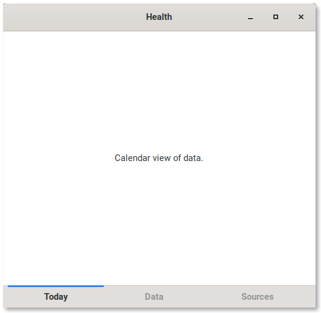

# Health
A health data monitoring app. Organize and collect all
your health data into one location.



## Build

### Compile Resources

```
cd ./src/resources/
glib-compile-resources --target=gnome-health.gresource gnome-health.gresource.xml
```

## References

### Code Coverage
https://coverage.readthedocs.io/en/v4.5.x/
https://docs.python.org/dev/library/unittest.mock.html

### PyGObject
https://pygobject.readthedocs.io

### Glade Layout

#### HeaderBar
https://gitlab.gnome.org/GNOME/glade/blob/master/src/glade.glade

### Sample App
OfflineImap is a good example of a python app packaged with snap.

https://github.com/snapcraft-docs/offlineimap/blob/master/setup.py

### Snap Docs
Instructions on packaging an app for snap.

https://docs.snapcraft.io/python-apps

### SQL Alchemy
Documentation.

https://docs.sqlalchemy.org/en/13/orm/tutorial.html

### Case Converter
Works pretty well.
https://convertcase.net/